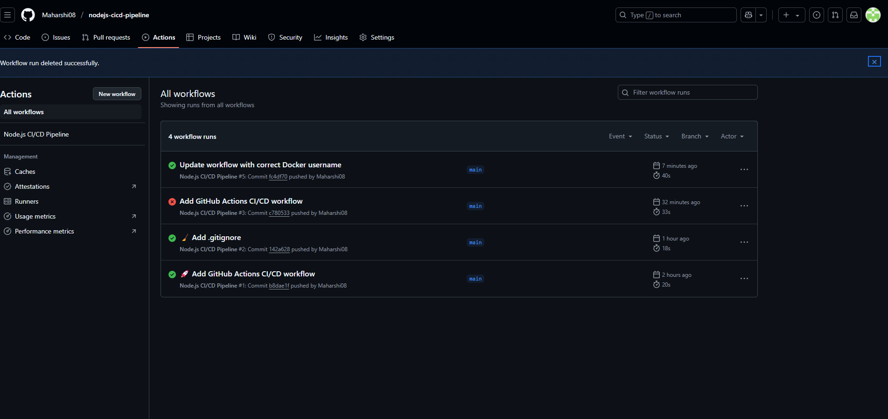

# 🚀 Node.js CI/CD Pipeline with GitHub Actions and Docker

## 📌 Objective
The goal of this task was to automate the process of building and deploying a Node.js application using a CI/CD pipeline powered by GitHub Actions and Docker.

## 🛠 Tools Used
- Node.js
- Docker & Docker Hub
- GitHub Actions

## 🔄 What the Workflow Does
- Triggers on every push or pull request to the `main` branch.
- Installs Node.js and dependencies.
- Runs test commands (placeholder).
- Builds a Docker image.
- Pushes the Docker image to Docker Hub (`maharshi86/nodejs-cicd-app`).

## 📦 Docker Hub
- [Docker Image Link](https://hub.docker.com/r/maharshi86/nodejs-cicd-app/tags)

## 🧪 Sample Workflow File
Located in `.github/workflows/main.yml`.

## ✅ Status
CI/CD automation is working as expected. On every push to `main`, the app is rebuilt and pushed to Docker Hub.

## 🖼️ Screenshots (Optional)

